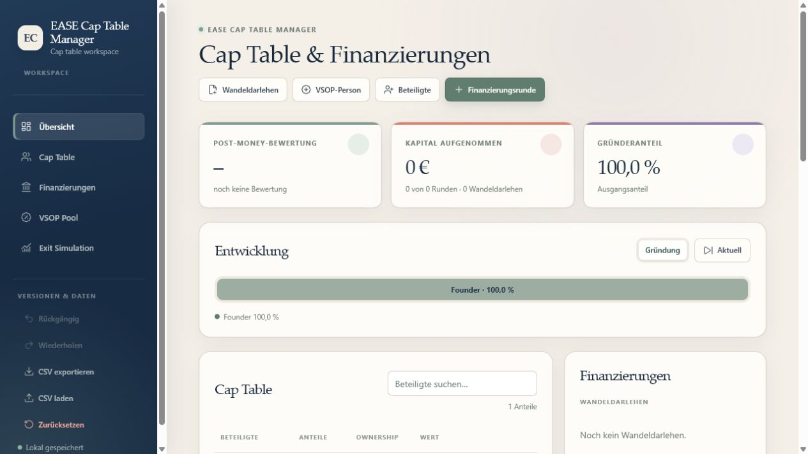
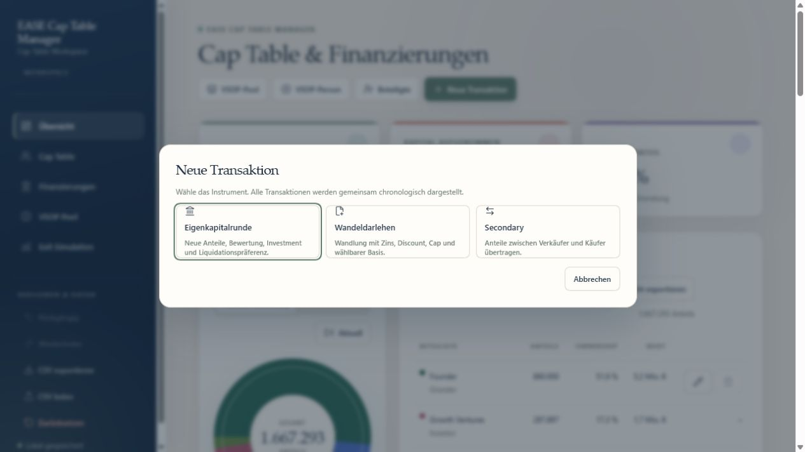
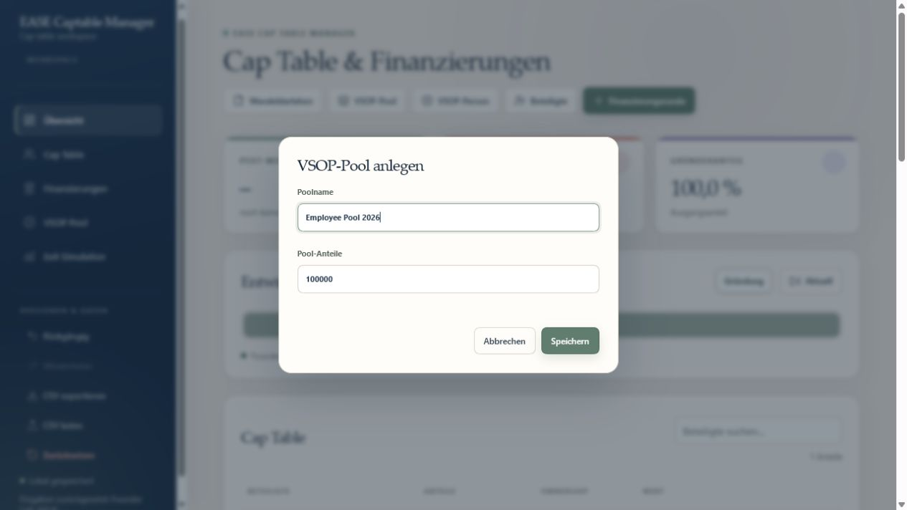
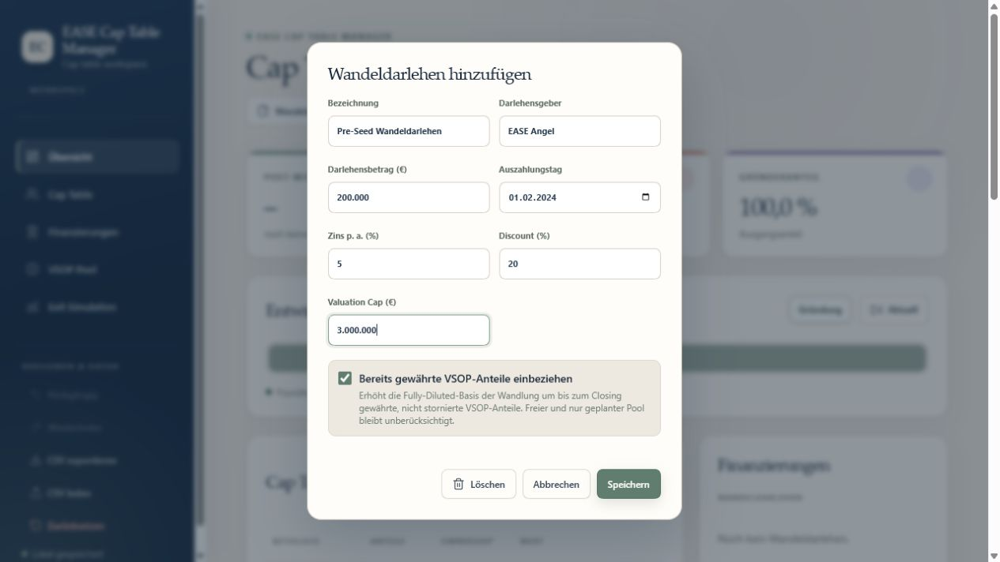
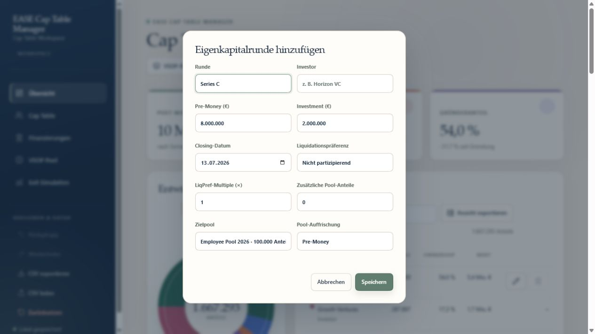
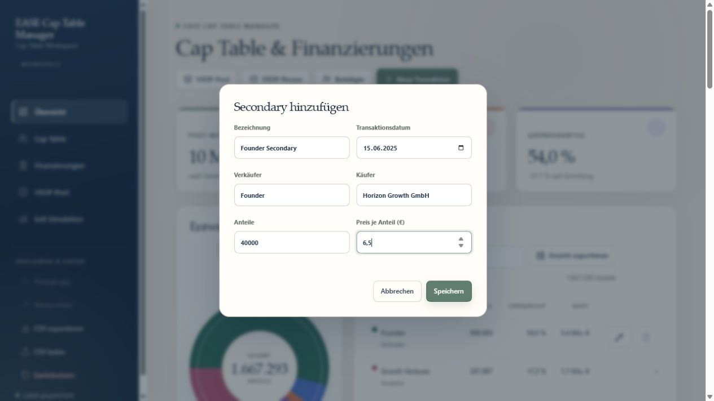
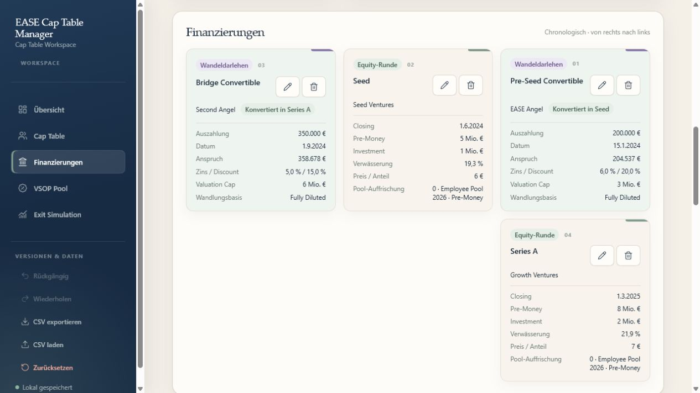
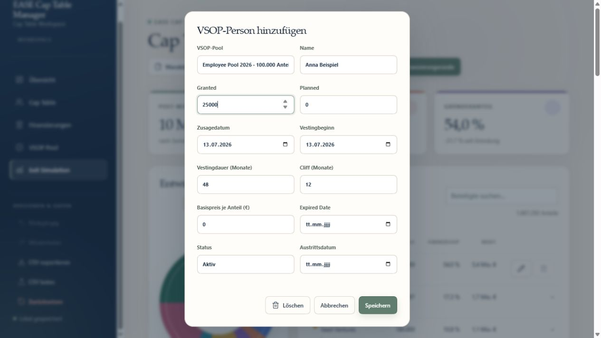
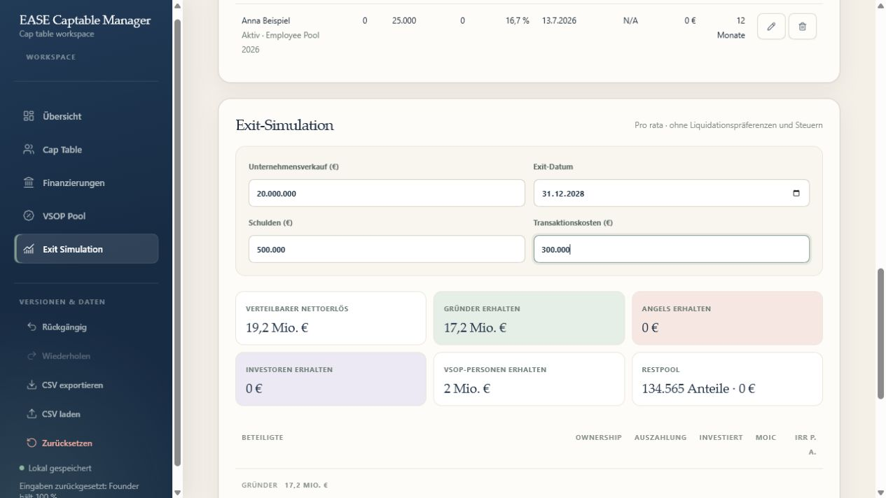

# Bedienungsanleitung: EASE Cap Table Manager

Der EASE Cap Table Manager ist eine lokale Browser-App für Cap Tables, Eigenkapitalrunden, Wandeldarlehen, Secondaries, mehrere VSOP-Pools und Exit-Simulationen. Alle Eingaben bleiben im lokalen Browserspeicher; ein Server oder Benutzerkonto ist nicht erforderlich.

## Schnellstart mit Beispieldaten

1. Öffne `index.html` in einem modernen Browser.
2. Klicke links unter **Versionen & Daten** auf **CSV laden**.
3. Wähle [`examples/ease-cap-table-example.csv`](../examples/ease-cap-table-example.csv).
4. Prüfe die importierten Daten in den Bereichen **Cap Table**, **Finanzierungen**, **VSOP Pool** und **Exit Simulation**.

> Beim CSV-Import wird der aktuelle Datenstand ersetzt. Exportiere vorher eine Sicherung, wenn du vorhandene Eingaben behalten möchtest.

## 1. Oberfläche und Navigation

Die Seitenleiste führt zu den fünf Arbeitsbereichen:

- **Übersicht** zeigt Kennzahlen, das Donutdiagramm und die danebenliegende Cap Table.
- **Cap Table** enthält Beteiligte, Anteile, Ownership-Werte und den Export der gerade sichtbaren Ansicht.
- **Finanzierungen** zeigt alle Instrumente gemeinsam chronologisch von links nach rechts.
- **VSOP Pool** verwaltet Pools sowie gewährte und geplante virtuelle Anteile.
- **Exit Simulation** verteilt einen angenommenen Verkaufserlös und berücksichtigt Liquidationspräferenzen.

Mit **Aktuell** springst du zum neuesten Transaktionsstand. Die Zeitpunkte unter **Entwicklung** wechseln zwischen Gründung, Eigenkapitalrunden und Secondaries. Das Suchfeld filtert die sichtbaren Zeilen der Cap Table nach Name oder Typ.

## 2. Transaktion auswählen

Klicke im Kopfbereich auf **Neue Transaktion**. Im Auswahlfenster stehen drei Instrumente zur Verfügung:

- **Eigenkapitalrunde** gibt neue Anteile aus und erhöht das aufgenommene Gesellschaftskapital.
- **Wandeldarlehen** wird bei einer späteren Eigenkapitalrunde gewandelt.
- **Secondary** überträgt vorhandene Anteile zwischen zwei Parteien; Gesamtanteile und Gesellschaftskapital bleiben unverändert.

VSOP-Pools, VSOP-Personen und Beteiligte legst du weiterhin direkt über die benachbarten Schaltflächen an.

## 3. Beteiligte und VSOP-Pools anlegen

1. Klicke auf **Beteiligte**, um einen echten Anteilseigner anzulegen.
2. Trage Name, Typ und Anzahl der Anteile ein.
3. Optional kannst du investiertes Kapital und Investitionsdatum für die spätere IRR-Berechnung ergänzen.
4. Klicke auf **Hinzufügen**.

Nutze die Stift- und Papierkorb-Symbole in der Cap Table, um Datensätze zu bearbeiten oder zu löschen. Mindestens eine beteiligte Person muss erhalten bleiben. Datensätze, die als Verkäufer einer Secondary benötigt werden, können erst nach Anpassung der Secondary gelöscht oder umbenannt werden.

Für virtuelle Anteile klickst du auf **VSOP-Pool**, vergibst einen eindeutigen Namen und legst die Poolgröße fest. Du kannst mehrere Pools parallel verwalten. Ein Pool lässt sich nur löschen oder verkleinern, wenn weder zugeordnete Personen noch Pool-Auffrischungen dadurch ungültig werden.

## 4. Wandeldarlehen erfassen

1. Öffne **Neue Transaktion** und wähle **Wandeldarlehen**.
2. Erfasse Darlehensgeber, Betrag, Auszahlungstag, Zinssatz, Discount und optional den Valuation Cap.
3. Entscheide über **Fully Diluted wandeln**:
   - **Aktiviert:** Alle bestehenden VSOP-Pool-Anteile – belegt, geplant oder frei – zählen zur Wandlungsbasis.
   - **Deaktiviert:** Die Wandlung wird nur auf Basis der echten Equity-Anteile berechnet.
4. Klicke auf **Speichern**.

Das Darlehen wandelt bei der ersten Eigenkapitalrunde, deren Closing-Datum am oder nach dem Auszahlungstag liegt. Die App berücksichtigt bis dahin aufgelaufene einfache Zinsen sowie den günstigeren Preis aus Discount und Valuation Cap.

## 5. Eigenkapitalrunde und Liquidationspräferenz

1. Öffne **Neue Transaktion** und wähle **Eigenkapitalrunde**.
2. Erfasse Investor, Pre-Money-Bewertung, Investment und Closing-Datum.
3. Wähle die Liquidationspräferenz:
   - **Keine:** Der Investor erhält ausschließlich seinen pro-rata Anteil.
   - **Nicht partizipierend:** Der Investor erhält den höheren Wert aus Präferenzbetrag und pro-rata Auszahlung.
   - **Partizipierend:** Der Investor erhält zuerst den Präferenzbetrag und nimmt danach zusätzlich an der Restverteilung teil.
4. Lege das **LiqPref-Multiple** fest, beispielsweise `1,0×`.
5. Optional kannst du zusätzliche VSOP-Pool-Anteile, den Zielpool und Pre- oder Post-Money-Auffrischung festlegen.
6. Klicke auf **Speichern**.

## 6. Secondary erfassen

1. Öffne **Neue Transaktion** und wähle **Secondary**.
2. Wähle den Verkäufer aus der zu diesem Zeitpunkt verfügbaren Cap Table.
3. Erfasse Käufer, Anzahl der übertragenen Anteile, Preis je Anteil und Transaktionsdatum.
4. Klicke auf **Speichern**.

Die App prüft die chronologische Verfügbarkeit der Anteile. Der Käufer wird bei Bedarf automatisch als Investor angelegt. Kaufpreis und Verkaufserlös fließen in Multiple und IRR ein; sie zählen nicht als von der Gesellschaft aufgenommenes Kapital.

Alle Instrumente erscheinen gemeinsam von links nach rechts und anschließend in der nächsten Zeile. Eigenkapitalrunden sind grün, Wandeldarlehen violett und Secondaries orange eingefärbt.

## 7. VSOP-Zuteilung verwalten

1. Stelle sicher, dass mindestens ein ausreichend großer VSOP-Pool vorhanden ist.
2. Klicke auf **VSOP-Person** und wähle den zugehörigen Pool.
3. Erfasse gewährte und optional geplante Anteile, Zusage- und Vestingbeginn, Vestingdauer sowie Cliff.
4. Optional kannst du Basispreis, Ablaufdatum, Status und Austrittsdatum ergänzen.
5. Klicke auf **Speichern**.

Die App prüft die Kapazität für jeden Pool getrennt und berücksichtigt zugeordnete Auffrischungen. Bei ausgeschiedenen Personen werden nur die bis zum Austritt gevesteten Anteile weiter berücksichtigt; stornierte Zuteilungen belegen den Pool nicht.

## 8. Exit simulieren

1. Öffne **Exit Simulation**.
2. Erfasse Unternehmensverkauf, Exit-Datum, Schulden und Transaktionskosten.
3. Prüfe Nettoerlös, Gruppen- und Einzelauszahlungen sowie ausgewiesene LiqPref-Beträge.
4. Vergleiche das **Multiple** aus Exit-Auszahlung plus bereits realisierten Secondary-Erlösen geteilt durch alle erfassten Investments. Bei positiver Auszahlung ohne Investment zeigt die App `∞×`.

Der vereinfachte Waterfall bedient Präferenzansprüche pari passu. Reicht der Nettoerlös nicht aus, werden alle fälligen Präferenzen proportional gekürzt. Nicht partizipierende Investoren wählen automatisch die wirtschaftlich bessere Alternative. Partizipierende Investoren erhalten Präferenz und Restbeteiligung. Bei VSOP-Personen gilt der Strike der gevesteten Anteile als Investment.

> Die Simulation bildet keine Anteilsklassen, Senioritäten, Caps, Steuern oder individuellen Vertragsklauseln ab. Eine LiqPref bleibt dem in der Eigenkapitalrunde erfassten Investor zugeordnet; die Übertragung von Präferenzrechten in einer Secondary wird nicht modelliert.

## 9. Cap Table exportieren, speichern und wiederherstellen

- Wähle unter **Entwicklung** den gewünschten Stand und setze optional einen Suchfilter.
- **Ansicht exportieren** lädt genau die sichtbare Cap Table mit Stand, Datum, Anteilen, Ownership und Wert als CSV herunter.
- **CSV exportieren** in der Seitenleiste erstellt dagegen ein vollständiges Backup aller Datensätze.
- **CSV laden** ersetzt den aktuellen Datenstand durch eine zuvor exportierte oder kompatible Datei.
- **Rückgängig** und **Wiederholen** verwalten bis zu 30 Datenstände.
- Tastaturkürzel: `Strg+Z`, `Strg+Umschalt+Z` und `Strg+Y` außerhalb von Eingabefeldern.
- **Zurücksetzen** bietet an, vor dem Löschen eine vollständige CSV-Sicherung zu erstellen.

Browserdaten sind an die aufgerufene Adresse gebunden. Öffne daher möglichst immer dieselbe `index.html` oder verwende bei einem lokalen Webserver dieselbe Adresse und denselben Port.

## 10. Aufbau der Beispiel-CSV

Die Beispieldatei enthält folgende `record_type`-Datensätze:

| Typ | Inhalt |
| --- | --- |
| `holder` | Zwei Gründer und der virtuelle Pool `Employee Pool 2024` |
| `convertible` | Wandeldarlehen mit Zins, Discount, Cap und Fully-Diluted-Wandlung |
| `round` | Eigenkapitalrunde mit 1× nicht partizipierender LiqPref und Pool-Auffrischung |
| `secondary` | Anteilsübertragung von einem Gründer an einen neuen Investor |
| `vsop` | Dem Pool zugeordnete aktive Zuteilung |
| `exit` | Beispielhafte Exit-Annahmen, bei denen die LiqPref sichtbar greift |

`liquidation_preference_type` akzeptiert `none`, `non-participating` oder `participating`; das Multiple steht in `liquidation_preference_multiple`. Eine Secondary verwendet `seller`, `buyer`, `shares`, `secondary_price_per_share_eur` und `closing_date`. `pool_id` verbindet VSOP-Personen und Pool-Auffrischungen mit ihrem Pool. `fully_diluted_conversion` steuert die Wandlungsbasis eines Darlehens. Datumswerte verwenden `JJJJ-MM-TT`; die Datei ist semikolongetrennt und UTF-8-codiert.

## Wichtiger Hinweis

Die Anwendung ist ein Planungs- und Simulationswerkzeug. Ergebnisse ersetzen keine rechtliche, steuerliche oder finanzielle Beratung und sollten vor Transaktionen mit den zugrunde liegenden Verträgen abgeglichen werden.
